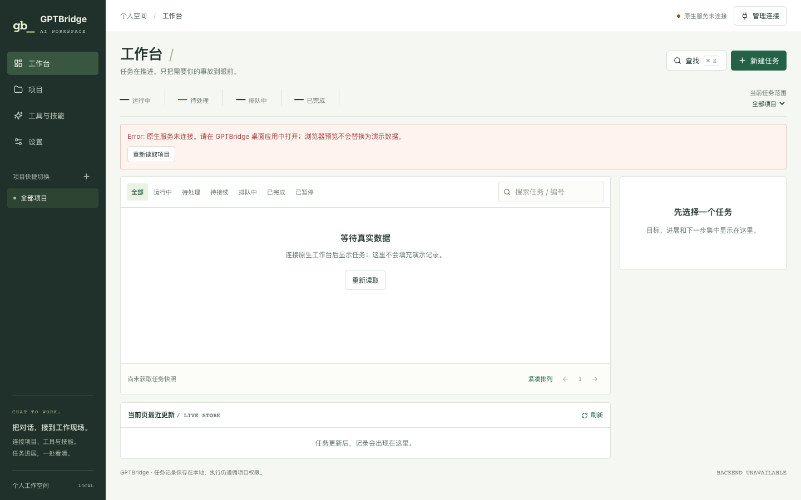
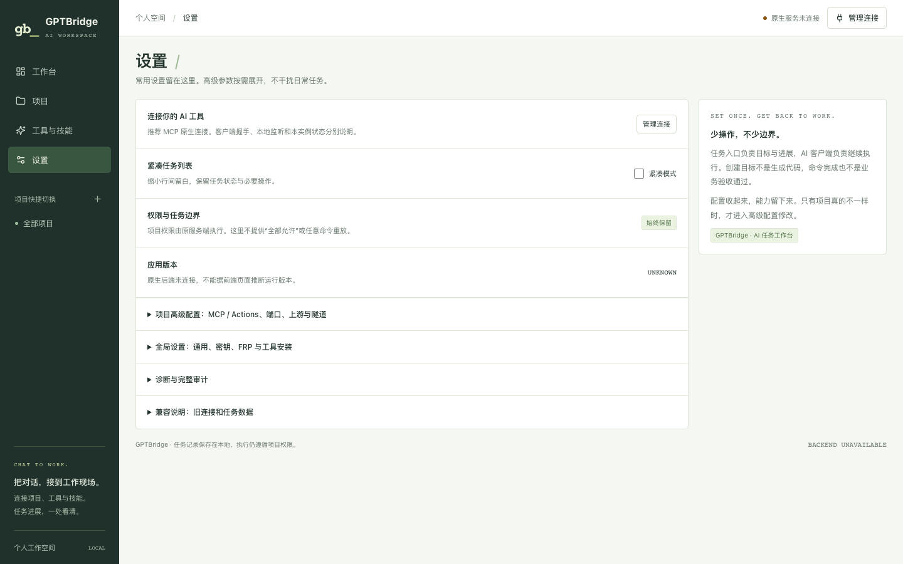

# GPTBridge 0.4.1 页面截图

本次使用已安装的 Playwright CLI 0.1.21 和 Chrome，打开 `npm run build` 的真实前端产物重新截图。桌面视口 1440×900，窄屏视口 375×812；后者是浏览器尺寸验证，不等同于真机或移动端用户代理测试。

**环境：real-built-frontend-browser-preview。Tauri 原生服务未连接，未注入模拟任务，未执行外部命令或项目操作。** 本批图片不进入真实业务验收的 current 目录；旧原型和历史截图不被覆盖。

| 页面 | 路由 | 桌面 | 窄屏 |
| --- | --- | --- | --- |
| 工作台 | `/` | [查看](screenshots/browser-preview-0.4.1/workbench-desktop.png) | [查看](screenshots/browser-preview-0.4.1/workbench-mobile.png) |
| 项目 | `/projects` | [查看](screenshots/browser-preview-0.4.1/projects-desktop.png) | [查看](screenshots/browser-preview-0.4.1/projects-mobile.png) |
| 工具与技能 | `/skills` | [查看](screenshots/browser-preview-0.4.1/skills-desktop.png) | [查看](screenshots/browser-preview-0.4.1/skills-mobile.png) |
| 设置 | `/settings` | [查看](screenshots/browser-preview-0.4.1/settings-desktop.png) | [查看](screenshots/browser-preview-0.4.1/settings-mobile.png) |

## 可核验记录

八次页面访问均返回 HTTP 200，页面标题包含 GPTBridge，渲染正文不含旧的 TaskDock 展示名称。文档及主内容区均未检测到横向溢出；本轮捕获的脚本异常、失败请求和控制台错误均为零。原生服务不可用仍以明确的页面提示显示，不计作连接成功。

逐张图片的 SHA256、视口和采集时间见 [capture-manifest.json](screenshots/browser-preview-0.4.1/capture-manifest.json)。源码及产物指纹见 [source-manifest.json](screenshots/browser-preview-0.4.1/source-manifest.json)。拍摄时工作区存在并发改动，完整指纹记录当时内容，不把该批截图称为纯净 Git 提交的原生验收。
