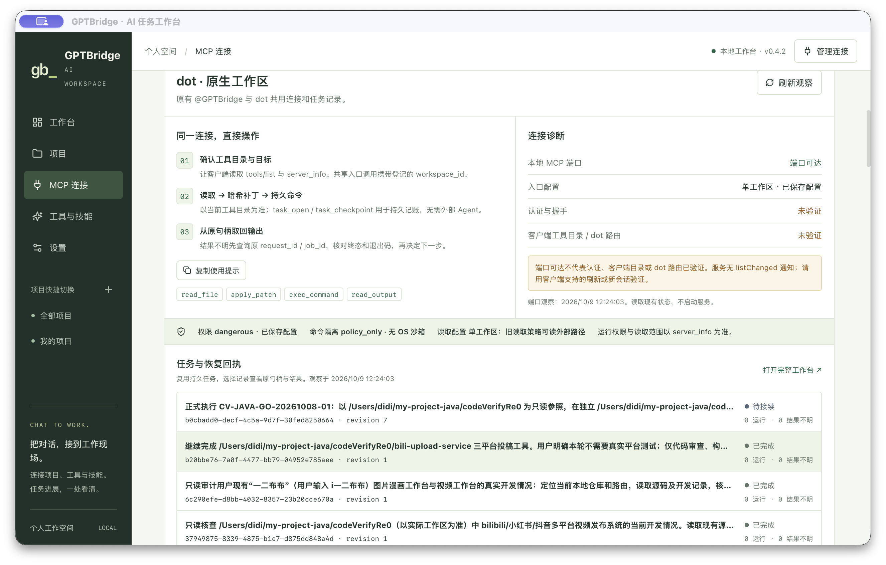

# GPTBridge dot 增量兼容交付记录

本次修复源码已提交推送，App 0.4.3 已替换并打开，安装版 19 步真实 HTTP/MCP 与原生界面验证通过。**常驻 MCP 服务仍为 0.4.2**：只读 SQLite 的现场运行环境差异已复现，使用现有兼容环境重试后仍由未闭合 RPC 空闲门禁阻断。配置和原任务保留。真实 dot 与旧客户端签收仍为 NOT_VERIFIED。

本轮当前事实、测试、安装身份、真实截图与未完成项见 [后续修复记录](fixes-20261009.md)、[安装版验收](release-fixes-evidence.json)、[原生 UI 回执](native-fixes-evidence.json)。本次源码提交 935791e6d47a70637e084c1c0fa8db8098aff702；495 Rust / 29 Node / 80 Python 均通过，Svelte 零错误零警告，生产构建成功。本轮原生错误状态矩阵与回滚实演尚未完成。

本文 Markdown 为事实真源，同名 HTML 从本文件生成。以下章节保留上次 0.4.2 交付时点的 SHA、PID 和结果，均为历史记录；不将历史“后台已切换”解释为当前服务升级完成。报告日期 2026-10-09。

## 需求与改动

需求来源为用户提供的 `GPTBridge-dot-产品方案与设计稿 (4).html`；[设计取证](ui-evidence.json) 记录附件 SHA `e8ddef604bc2a80a14ab39c697f283385ae5ce0cd37a09d3b39de41eaa8dc203`。附件中的连接、任务和回执是模拟设计，只作需求与视觉参考。

- 同一 `/mcp`、认证和原生工具继续使用；`task_open` / `task_checkpoint` 明确用于持久记账与恢复，不要求委托外部 Agent。
- `server_info` 增加可忽略的 `direct_workspace` 说明；六个原工具只更新审核过的 description，不改名、完整 inputSchema、annotations 或暴露分层。
- 工作区详情同页增加指南、真实连接观察和任务/恢复回执，复用现有只读 IPC；复制操作只复制文本，没有新增执行器或远程执行权限。
- 文档补完整真实参数示例、哈希冲突/幂等处理、原 job/session 输出恢复、目录刷新与回滚步骤。

安全事实保持原行为：命令为 `policy_only`、`sandbox_enforced=false`；单工作区旧读取允许显式外部绝对路径或 `..`，共享网关按真实 strict-read 标志限制在选定根目录。当前 `tools.listChanged=false`，SSE Accept GET 返回 405；客户端缓存刷新和 dot 路由仍需独立验证。不承诺客户端自动选择、绕过确认或特定计费结果。

## 源码、所有权与提交

| 项目 | 事实与来源 |
| --- | --- |
| 仓库 | `/Users/didi/my-project-java/codeVerifyRe0/coding-tools-mcp-personal`，独立个人仓库，main |
| 基线 | `17f47d3d261aa23f9e8d2c11d269438e000bceba` |
| 本轮源码提交 | `4b2215386b175e97ffff5fb7bf31af6b5a43e6f7`；来源为 [构建与远端回读回执](build-receipt.json) |
| commit / push | 已完成，唯一 Git/安装协调者 root 执行 |
| 远端独立回读 | PASS，`remote_main_readback=4b2215386b175e97ffff5fb7bf31af6b5a43e6f7`，与本轮源码提交一致；来源为 [build-receipt.json](build-receipt.json) |
| foreign dirty | 保留；[所有权回执](ownership-check.json) 确认 15 个未触碰路径及 README/dispatch/registry 重叠片段 |
| 干净候选 | foreign hunks 未进入候选，`candidate_has_foreign_hunks=false`；没有整仓暂存、覆盖或回滚 |

本轮精确改动范围为协议说明/只读 getter/兼容测试、工作区指南与状态模块、用户文档/规格、Goal 和本主题证据。README 的 foreign 打包清理说明保留；既有 foreign 代码与未跟踪工作由其原作者继续维护。无认证、数据格式或策略迁移，无数据库 DDL、MQ 与全局配置变更。

## 合同与验证结果

验证使用排除 foreign hunks 的干净候选；[测试结果](test-results.json) 保存各日志 SHA 与实际通过数，[合同差分](catalog-diff.json) 保存白名单与零违规结论。

| 验证 | 结果 | 覆盖与限制 |
| --- | --- | --- |
| Rust 主仓回归 | PASS，466 项 | 既有工具、路径/权限、任务与恢复回归；保留编译器已有 warnings，与前端检查零警告分别报告 |
| personal-runtime | PASS，74 项 | 持久 worker、原请求去重/恢复、资源锁与输出分页 |
| dot 协议专属测试 | PASS，6 项 | 真 dispatcher / 持久 worker 的临时工作区闭环、旧字段与 read_scope、冲突/归属反例；计入主仓总数，不重复累计 |
| Node 测试 | PASS，22 项 | 相关前端状态/行为测试 |
| Svelte check | PASS，0 error / 0 warning | 干净候选类型检查 |
| Vite build | PASS | 干净候选前端生产构建 |
| 目录合同 | PASS，0 非白名单差异 | core/read-only/advanced/compat-readonly-all 四档，39/26/52/52 个工具；完整 schema 与 annotations 比对，仅六类 description 白名单变化 |
| 规格检查 | PASS，8 FR，0 error / 0 warning | [check_spec 回执](check-spec-result.json)，不代表业务签收 |
| 文档示例 | PASS，10 个 JSON 示例 | [真实基线 schema 检查](documentation-schema-check.json)，占位 ID/hash/ref 需替换，不执行示例命令 |
| 隔离 HTTP/MCP 闭环 | PASS，16 步 | [真实 HTTP 回执](isolated-http-evidence.json)：401/SSE405、读改运行、原 job/session 分页、幂等/旧哈希与只读反例；使用相同源码的 debug 制品，不是已安装 App 的业务写入验收 |
| 已安装 OAuth/MCP | PASS | [目录](installed-after-catalog.json) / [server_info](installed-after-info.json)：正常 OAuth PKCE、39 tools、native/HTTP 完整 schema 与 annotations 一致、运行版本 0.4.2 和 direct_workspace 生效；仅元数据只读请求 |
| dot 客户端 | NOT_VERIFIED | 真实目录发现、缓存刷新、平台授权与调用闭环未签收 |
| 原有 `@GPTBridge` 客户端 | NOT_VERIFIED | 原请求结构回归通过；真实客户端端到端调用未签收 |

## 界面与视觉证据

[视觉评审](visual-review.md) 区分附件模拟、静态原型与实际编译 Svelte 组件的原生后端未连接态。组件桌面与 375px 截图已采集，浏览器 console error=0；375px 文档宽度为 375，无横向溢出，组件各区人工 rubric 为 95–97 分。原生 App 的 minWidth 没有改变，这些截图不宣称 App 支持手机运行。

looks-same 与 pixelmatch 指标及 diff 已保留于 [visual-metrics.json](visual-metrics.json)。因现有绿色产品壳、同页布局和真实未连接态不同于附件模拟，比较 `equal=false`，没有将像素差异包装成通过。截图来源 SHA 固定于 [ui-evidence.json](ui-evidence.json)；其最后一次防止旧回执残留的修改发生在截图后，已明确记录。

**本机原生 UI：PASS。** 已打开真实安装 App，观察到 0.4.2、dot 工作区指南、真实端口观察、六项原任务和持久回执；实际打开原作业的只读输出，读取字节范围 `0 → 227`，没有可见读取错误，再关闭输出对话框。截图来自真实 App 窗口，不使用 mock IPC。图中认证/客户端路由仍显示未验证，表示 UI 自身未主动验证；另有本轮独立正常 OAuth 回读。

窗口截图不包含系统独立的意外退出提示；该提示的真实状态另记于安装回执。

## macOS App 制品

App 从已提交源码的干净导出构建，没有包含工作树 foreign diff。[build-receipt.json](build-receipt.json) 保存源码/远端 SHA、构建命令、退出码、架构、签名及制品哈希。源码归属补充回执为 `/tmp/gptbridge-dot-20261009/build-source.json`，构建日志为 `/tmp/gptbridge-dot-20261009/desktop-release-build.log`。

| 字段 | 当前制品事实 |
| --- | --- |
| 源码提交 | `4b2215386b175e97ffff5fb7bf31af6b5a43e6f7` |
| 干净源码路径 | `.artifacts/dot-compatibility/release-source` |
| App 路径 | `.artifacts/dot-compatibility/release-target/release/bundle/macos/GPTBridge.app` |
| 版本 | Info.plist 的短版本和 bundle version 均为 0.4.2 |
| 架构 | `Mach-O 64-bit executable arm64` |
| 可执行文件 | `Contents/MacOS/coding-tools-mcp-personal` |
| 可执行文件 SHA256 | `d94e9aa7c0f4b39aa2dff1de7aff1b90f03e95db126c573f843136e31645799d`；本记录按当前候选字节读取，安装后另核 |
| App 树 SHA256 | `91acfc945a1c94b97390c162fb73b1a617564ea9024c8ca989faa8462337fe06`；来源为构建回执 |
| 签名 | 本机 ad hoc，严格 codesign 验证退出 0；这是本机签名，不是公证发行签名 |
| 构建 | release App bundle 成功，构建退出 0，日志记录唯一 App 路径 |

## 本机替换与运行收口

本节 PID 与状态来自上次安装回执时点；当前新 boot 的只读健康观察、旧故障未复现及根因边界另记于 [fixes-20261009.md](fixes-20261009.md)，不回写或替换旧取证身份。

安装过程中曾等待其他任务的 running job 结束，没有取消其他作业。替换阶段对 live data 做精确字节备份并保持原值；新 GUI 启动后 profiles.json 序列化格式发生变化，解析后的配置语义与备份完全一致。服务重启冻结并保留启动后的新 SHA，不恢复旧配置。[安装回执](installation-receipt.json) 与 [安装独立回读](installed-readback.json) 记录各层事实。

| 收口项 | 状态 | 真实证据 |
| --- | --- | --- |
| 实际目标 `/Users/didi/Applications/GPTBridge.app` | PASS，0.4.2 | 原路径 metadata、binary SHA 与 App tree SHA 同本轮候选；严格 codesign 退出 0 |
| 新 GUI 进程 | PASS | PID 90327，实际安装路径，真实版本与页面 |
| MCP / HTTP 运行服务 | PASS | 服务 PID 95384，实际映射安装 binary；正常 OAuth initialize/tools/list/server_info 通过；0.4.2、39 个工具及能力元数据核实 |
| FRP | 保留 | 原进程 PID 1207，未修改 plist、未重启该服务 |
| 原生工作区 UI | PASS | 真实截图、任务/回执读取、原输出 0→227 字节，无 mock |
| 客户端缓存与调用 | NOT_VERIFIED | dot 和原有客户端的平台发现、刷新与实际业务闭环仍未签收 |
| 回滚点 | PASS | `/Users/didi/Library/Application Support/coding-tools-mcp-personal-backups/20261009T041200Z-1791519120089246000/previous.app`；完整 0.4.1 App 和私密 data 备份保留 |

重启前标准只读 SQLite 查询曾间歇返回 CANTOPEN，未写库修复或修改 journal。最终仅在 live main 文件身份、大小、mtime 和字节 SHA 前后相同，WAL/SHM/journal 都不存在时制作本轮独占 0600 临时副本；`immutable=1` 仅用于这些被冻结的副本。三个新的独立快照分别确认 queued/running/unknown 为 0，副本立即删除，随后再次检查配置/plist/binary/PID/RPC 空闲，再精确重启既有 LaunchAgent。源码库和 live 数据库都没有由这项检查写入。

首次后台启动 PID 95319 被 macOS 以 `SIGKILL (Code Signature Invalid)` / `Launch Constraint Violation` 终止；既有 KeepAlive 随后成功启动 PID 95384，正常 OAuth 与独立进程读回均通过。根因未确定，不将该失败描述为功能测试成功。系统留下独立的“意外退出”提示；Computer Use 安全规则拒绝操作 `com.apple.UserNotificationCenter`，因此没有关闭该提示，也未对外发送报告。用户可在系统提示中选择“忽略”。

回滚使用保留的旧 App：安全退出新版，恢复原安装路径并核字节、进程及服务，保留持久状态。不重置用户工作树；客户端目录缓存仍可能需要其支持的刷新。

## 上次报告完成范围

已完成上次源码交付、回归、debug 临时实例的真实 HTTP 闭环、目录合同、提交推送、同源码 App 构建、本机替换、正常 OAuth 与正常原生 UI 回读。上次收口提交只保存安装/测试/截图与清理文档，App 的源码归属仍为 `4b2215386b175e97ffff5fb7bf31af6b5a43e6f7`。完整回执/诊断/输出、installed release 写改闭环和场景组合等本次缺口不能据此宣称完成。

[清理回执](cleanup-receipt.json) 记录本轮可重建导出源码、依赖及编译缓存的精确路径、大小与删除后回读；当前 App bundle、冻结的 HTTP 测试可执行文件、已安装 App、0.4.1 回滚包和正式验证证据保留。

未验证项为真实 dot / @GPTBridge 客户端的目录刷新、平台授权和业务调用；首次 macOS 启动约束失败的根因未确定，当前新版监听器已恢复。

执行入口：[Goal Markdown](../../goals/gptbridge-dot-compatibility-goal.md) / [同名 HTML](../../goals/gptbridge-dot-compatibility-goal.html)；使用说明：[dot-compatibility.md](../../dot-compatibility.md)。
