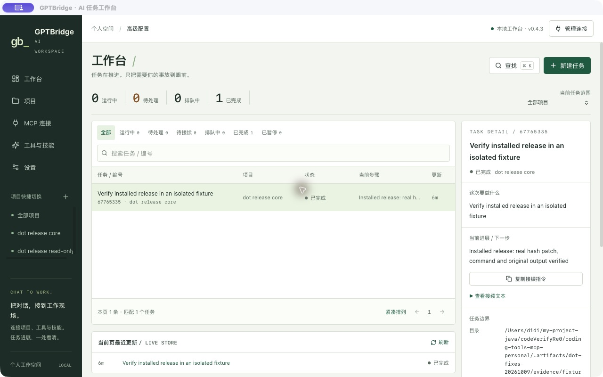
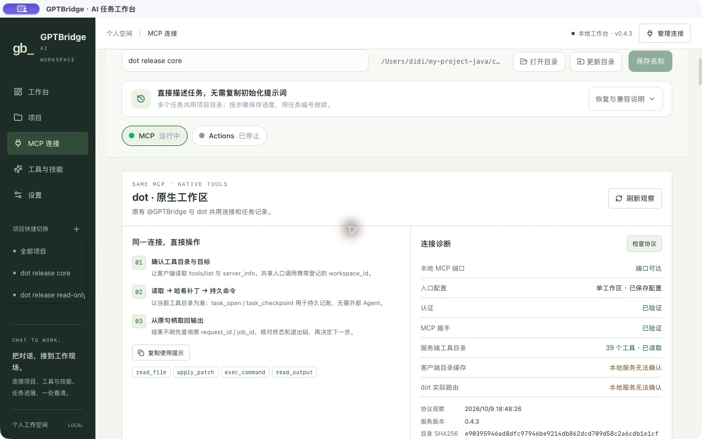
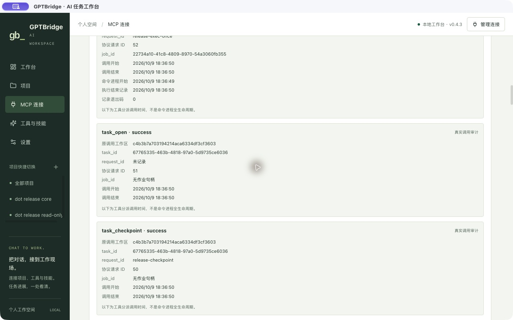
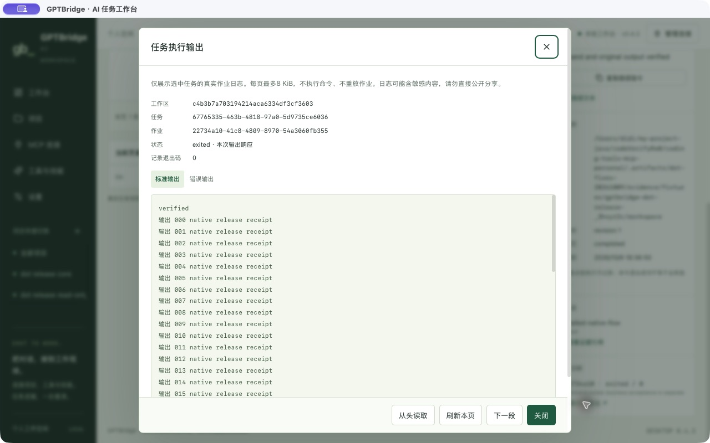

# GPTBridge dot 后续修复与验收记录

本次已修复回执、真实协议诊断、输出状态和安全重启门禁，源码已提交推送，干净源码构建的 App 0.4.3 已替换并打开。495 项 Rust、29 项 Node、80 项 Python，以及安装版 19 步真实 HTTP/MCP 闭环通过。原生界面诊断、任务回执和输出读取通过。常驻 MCP 仍为 0.4.2：SQLite 运行环境差异已定位到可重复现场，另有未闭合 RPC 日志使重启门禁继续阻断。真实双客户端、旧系统启动约束与黑屏根因仍未完成。

Markdown 为本记录真源，同名 HTML 从最终 Markdown 生成。日期：2026-10-09。用户附件 `GPTBridge-dot-产品方案与设计稿 (4).html` 仅作已确认需求和模拟设计参考，不扩展为认证/权限迁移或 P2 实施授权。

## 执行范围与身份

| 字段 | 本次事实 |
| --- | --- |
| 仓库 / 分支 | `/Users/didi/my-project-java/codeVerifyRe0/coding-tools-mcp-personal` / main |
| 本次源码基线 | `9135ea702b721878457f933420d4f035bb147722` |
| 已安装制品来源 | 本次源码 `935791e6d47a70637e084c1c0fa8db8098aff702`，App 0.4.3；常驻 MCP PID 3649 仍为上次 0.4.2 |
| 本次计划 ID | `bugfix-继续修复gptbridge-dot交付遗留缺口-拉取最新app-laun-18de67f569` |
| 外部写入协调者 | root；子代理不执行 Git、安装或平台配置修改 |
| 现有工作保护 | 保留 18 个 foreign 路径及其他作者工作；不整仓暂存/覆盖/清理 |
| Goal 状态 | 不新建 Goal；上次原生 Goal 的 complete 仅表示其已记录交付阶段，不证明附件全部客户端/界面验收通过 |

本次范围为已有 audit 的严格只读回执投影、正常认证 loopback MCP 协议诊断、UI 输出元数据消费及持久普通只读空闲门禁。服务和 UI 仍复用原工具/数据库/任务，不新增执行器、任务格式、权限或认证策略。

## 9 项缺口与当前状态

| 编号 | 缺口与归属 | 当前状态 | 可核验的完成条件 |
| --- | --- | --- | --- |
| 1 | 工具/工作区/时间/补丁哈希的统一回执，P1 | INSTALLED / NATIVE_UI_PASS（隔离真实数据） | 真实 task/profile 归属的有界回执显示；原字段保留，缺历史值为 null/未知，不猜补 |
| 2 | 真实认证/initialize/目录运行诊断，P1 | INSTALLED / NATIVE_UI_PASS（隔离真实数据） | 正常认证的 loopback initialize/tools/list/server_info 返回当前运行版本/目录；缓存与 dot 路由不可观察时继续未知 |
| 3 | retained/truncation/job status 输出反馈，P1 | INSTALLED / NATIVE_UI_PASS（隔离真实数据） | 完整消费真实状态、退出码、保留/截断/损失标记和分页；未知/部分输出不显示完整成功 |
| 4 | dot 真实客户端闭环，P0 | PENDING / NOT_VERIFIED | 实际 dot 客户端沿原连接器完成认证、目录、read/hash patch/durable exec/原句柄输出，并保存脱敏轨迹 |
| 5 | 旧 `@GPTBridge` 真实客户端回归，P0 | PENDING / NOT_VERIFIED | 原连接器身份和旧请求在实际客户端完成同一闭环与原任务恢复 |
| 6 | 真实客户端刷新/新会话/断线恢复，P0 | PENDING / NOT_VERIFIED | 记录真正有效的刷新流程，断线后查询原 task/request/job，无重复副作用 |
| 7 | 已安装 release 完整写改运行闭环，交付验收 | PASS / 19 步真实安装版隔离验收 | 用当前安装 binary/服务身份执行完整 fixture 闭环；debug 的旧 16 步不替代 |
| 8 | 旧 macOS Launch Constraint 失败，交付稳定性 | ROOT_CAUSE_NOT_VERIFIED | 获得精确系统约束证据或明确无法确定的边界；不无依据改 Rust/签名政策 |
| 9 | 旧 SQLite RO CANTOPEN，交付稳定性 | CURRENT_ENV_DIFFERENCE_REPRODUCED；门禁 PASS；历史根因未闭合 | 普通 RO 持久连接可靠观察新工作、校验路径身份、错误 fail closed；机制测试不宣称旧根因已确定 |

各状态只覆盖对应证据。原生 UI 正常数据、输出 EOF、错误输出与 Escape 已验；空/错误/未知的组合场景主要由测试覆盖，尚无完整原生截图矩阵。客户端和常驻服务切换不得由安装版隔离验收替代。

## 已确认源码缺口与边界

1. **回执来源不完整。** `taskdock_task` 的原 `task_view` 没有 operation receipt；既有 audit `query/get` 会触发 cleanup，`Store::open` 包含 DDL/初始化，不能用于本次严格只读投影。原 jobs 读取可能 reconciliation，本次不把这些入口包装成“只读”。新增独立 `taskdock_receipts` IPC 仅读已有资料，严格验证 task/profile，限制数量和正文大小；缺失历史字段如实保留。
2. **TCP 可达不能证明协议和认证。** 既有连接观察只有 TCP 300ms 探测与普通 GET 健康信息，不能证明正常认证、initialize 或工具目录。本次独立 `taskdock_diagnostics` IPC 按已保存 none/bearer/OAuth PKCE 正常路径读 loopback；只在首次或用户手动诊断执行。没有可用凭据/服务时返回真实不可用，不复制或日志输出凭据。
3. **前端输出反馈未消费完整字段。** 本次将现有输出的保留、截断/损失、分页及 job 状态纳入 UI。实际字段覆盖与失败状态须等本次代码/测试结果，不能依据旧正常日志截图判定完成。
4. **空闲检查连接生命周期可加固，旧 CANTOPEN 根因未知。** `Store::at` 使用持久 WAL，`Store::conn` 按操作创建连接；旧 `foreign_jobs` 每次另开 Python RO 连接，`guarded_restart` 连续重查。频繁 connect/close 是有机制依据的排查方向，缺 errno/SQLite 扩展错误码时仍不能定根因。新的 `JobIdleObserver` 使用普通 RO URI、query_only、autocommit、及时关闭 cursor、nofollow 与 dev/inode 身份校验，在预等待和最终三次门禁复用同一连接。

相关实现路径由对应 owner 维护：`src-tauri/src/commands/taskdock_receipts.rs`、`taskdock_diagnostics.rs`、现有 taskdock 输出 identity 片段、UI 输出/回执/诊断组件、`scripts/service_personal.py` 与 `scripts/restart_personal.py`。当前路径与功能为本次实施范围，不代表已验证或已发布。

## 当前启动与只读审计事实

北京时间 16:18–16:21 的只读审计显示，2026-10-09 16:06:38 新 boot 下 UI PID 1092、managed MCP PID 2432、FRPC PID 2439 正常；MCP 实际监听 `127.0.0.1:28766`。该历史时点 App 为 0.4.2，主 executable SHA `d94e9aa7c0f4b39aa2dff1de7aff1b90f03e95db126c573f843136e31645799d`，严格签名验证退出 0。

旧 PID 95319 的报告是 macOS 在启动阶段以 `CODESIGNING` code 4 / `Launch Constraint Violation` 终止，约 0.159 秒结束，没有 Rust panic 或业务栈。当前签名没有嵌入 launch constraint 槽，LaunchAgent 也没有相关显式约束项，但不能据此排除其他系统政策。精确旧时间窗 AMFI 统一日志读取两次超时，没有可用约束字段；本次不重复广泛扫描，不将缓存/自动 spawn 推测写成根因。

同一普通 `mode=ro`、`query_only=ON`、autocommit 连接的三次标准查询均读到 queued/running/unknown 为空，cursor 已释放、`in_transaction=false`，main mtime/ctime 保持。截至该次审计旧 CANTOPEN 未复现；后续切换预检已再次复现，见末节；运行中的 WAL/SHM 不能强行归属到某个进程。本次不写 live DB 修复、不改 journal、不对 live DB 直接使用 immutable 读取，不为诊断重启当前正常服务。

## 本次精确验证标准

| 组 | 必须观察的结果 | 不接受的替代证据 |
| --- | --- | --- |
| 只读回执 | 已有数据库/审计的有界投影；跨 task/profile 拒绝；缺字段为空；查询前后业务记录与历史不变 | Store::open 初始化或 audit cleanup/reconciliation 后声称严格只读 |
| 标准协议诊断 | 正常 none/bearer/OAuth 路径的 loopback initialize/list/info；真实运行版本/目录/错误；无凭据泄露 | TCP 或普通健康 GET 当作握手/授权/客户端目录成功 |
| 输出状态 | job 归属、状态/退出码、保留字节、truncated/lossy、递增偏移与终点；失败/unknown/部分输出文案准确 | 看到一段日志或 HTTP 200 就显示完整完成 |
| RO 生命周期门禁 | 真实临时 WAL writer 的新提交可被观察；最终检查出现新工作则阻断；文件缺失/替换/软链接/SQLite 错误 fail closed；连接/cursor 释放 | 只测无工作成功路径，或失败时继续重启/放宽只读 |
| 原生 UI | 键盘、加载/空/错误、长路径、unknown 和正常回执/诊断/完整输出逐项截图与操作证据 | 旧原型、mock、只有正常状态截图 |
| release 闭环 | 已安装 binary SHA/服务 PID/映射路径与本次制品一致，完整 fixture read/patch/exec/output/checkpoint | 同源码 debug 回归、元数据只读或原 job 输出只读 |
| 客户端 | dot 与旧客户端各自真实工具轨迹，刷新/新会话与原请求恢复独立记录 | 脚本 HTTP 测试、宿主页面可见、服务目录更新 |
| 回滚实演 | 独立可恢复候选验证旧 App/配置/任务句柄，再回读；当前活动任务有安全门禁 | 有备份路径就声称演练完成 |

本轮已验证：前端生产构建、Svelte 0 errors / 0 warnings、Node 29/29、Python 80/80，Rust 全部目标最终 495/495，后端编译检查通过。最终后端包括真实无认证配置反例；0.4.3 安装、19 步闭环和原生界面证据见末节。上次结果保留在 [原交付记录](delivery.md)，不替代本轮输入和验收。

## 双客户端真实验收步骤

dot 和原有 `@GPTBridge` 各执行一遍，留客户端名称/版本、会话、原连接器身份、端点/认证方式（脱敏）、workspace 模式和本次 installed release 身份。所有 fixture 仅使用本轮独占且已授权的工作区目录。

1. 在实际客户端选择原连接器；轨迹必须使用该 MCP，不用另一套本地执行器代替。单工作区核项目，网关先 `workspace_list`，每次业务调用带登记 `workspace_id`。
2. 经正常认证读取真实目录与 `server_info`，核运行版本、说明、工具完整 schema/annotations 和模式；服务器指纹只证明服务器，不推断客户端缓存。
3. 观察当前会话目录，使用客户端支持的刷新/重新初始化，再在同连接器新会话核验，记录哪条路径实际有效。缺旧缓存或不可观察的目录字段保留未验证。
4. `task_open` 保存真实 task ID/revision；`read_file` 保存 fixture 内容与整个文件 `file_sha256`。
5. `apply_patch` 携带稳定 request ID、task ID 和真实哈希；独立回读文件。相同载荷去重、过期哈希拒绝，不能丢失其他写入。
6. 启动非交互 durable 校验，正确声明 read/build/write，保存原 request/job/session；从实际退出状态、exit_code、command_ok 判断结果。
7. 原 `write_stdin` / `read_output` 有界分页，沿真实 next_offset 到终点，核完整输出、保留/截断/损失标记与归属。
8. 受控无业务副作用命令运行期间断开客户端，重新连接或新会话后查原 task/request/job；不重复创建命令。相同原请求重试返回原 job/去重回执。
9. 使用最新 revision 与稳定 ID 保存检查点，核真实工具轨迹及文件/输出，分别签收 dot 与旧客户端。缺实际入口或平台观察能力保持 `NOT_VERIFIED`。

## 明确延期与状态更新规则

P2 的 SSE/listChanged 通知、真正 OS 沙箱、策略加固和暴露模式迁移延期，不混入当前修复。计费、自动选择连接器和绕过确认继续不作保证；附件模拟 Tab、演示下一步和重置按钮不是待实现真实执行流程。

本次实施、测试、构建与安装已按实际回执更新。对根因未知的 8/9 项，当前健康、未复现或门禁加固分别记录，不能改成“故障已修复”。

## 最新日志与实际修复证据

日期为 2026-10-09；以下时间为北京时间。

- 旧 App 签名启动失败仍只有 12:20:53 的 `.ips`：CodeSignatureInvalid / LaunchConstraintViolation，没有新的 GPTBridge 崩溃报告。严格签名和当前启动成功不证明旧系统约束已确定。
- 17:48 左右 Mac 再次重启，17:52 观察 uptime 4 分钟。此前未结束的 Cargo/npm 构建中断，临时目录证据丢失。后续日志改存项目 `.artifacts/dot-fixes-20261009/evidence/`；系统重启原因未确定，两个最新 Node SIGABRT 报告的调用来源也未确定。
- 新 boot 原生 UI PID 1054、MCP PID 3649、FRPC PID 3656。17:50 后台窗口观察到黑内容区；17:51 仅 Raise 激活窗口后真实任务和详情显示，没有退出或重启。该观察不能证明黑屏根因已修复。
- 生产普通只读查询成功。隔离 Python 3.9 / SQLite 3.54.0 下，刚切 WAL、尚未写入且没有 sidecars 的数据库首次普通只读 SELECT 可复现 CANTOPEN；已有 sidecars 的连续 WAL 写入通过。尚未与历史生产现场建立相同条件。
- 回执专项先得到 25 PASS / 2 FAIL：macOS `/var` 与 `/private/var` 别名导致合法 worker 元数据被拒绝。已同时规范化父目录和文件，再检查目录边界，原始时间断言保留；新增别名、外部文件、直接及目录软链接越界回归。
- “none 配置一定产生 false/none server_info” 的假设已由当前与 HEAD 源码证伪：实际 auth_enabled 是 type != noauth。没有放宽生产诊断，另补真实 HTTP 反例防止认证误报成功。
- 精确暂存影响分析为 HIGH：37 个本轮文件、18 个映射符号、8 条流程。全工作区 CRITICAL 包含 18 个他人路径，未混入本轮提交。应用 run 只新增两个 handler；重启检查由 80 项回归覆盖。新模块索引缺失保持 UNKNOWN。

| 阶段 | 当前结果 |
| --- | --- |
| 源码与版本 | 0.4.3 五处项目版本一致；保留他人改动，未修改 MCP schema、dispatcher、生产 DDL 或权限策略 |
| 前端 | 29/29 Node；Svelte 0/0；生产构建通过；持久日志 node-tests.log、frontend-check.log、frontend-build.log |
| 安全重启 | 80/80 Python；普通 RO 同连接贯穿最后检查、unknown 阻断、端口/PID/映射 executable 回读；python-tests.log |
| 后端 | 最终 495/495（其中 29 项新增专项）；后端编译通过，cargo-final-tests.log / cargo-final-check.log |
| 审查 | 监听归属、真实认证模式、冲突/dry_run 借旧 hash、无 child 的进程结束误报均关闭；路径别名修复原断言保留 |
| 安装版基线 | 重启前安装 0.4.2 的 19 步真实 HTTP/MCP 通过，原 request 恢复唯一 job、13 页 UTF-8、副作用一次；临时回执丢失，不替代 0.4.3 |
| 本轮安装与 UI | 0.4.3 App 替换、配置原字节保留、严格签名通过；真实隔离 UI 的诊断/回执/输出通过；常驻服务未切换 |
| 客户端 / 回滚实演 | NOT_VERIFIED；真实 dot/旧客户端入口尚未识别，3.4.2–3.4.4 保留未勾选 |

## 0.4.3 最终安装与真实验收

源码提交 `935791e6d47a70637e084c1c0fa8db8098aff702` 已正常 push 并独立回读 origin/main。App 从该提交的干净 archive 构建，不含 18 个 foreign 路径；本地 ad hoc 重新封签后严格 codesign 通过。最终 executable SHA256 为 `443c192f8b655ed980d8480171230e1bc56e9d8f9538c45a6cb5ae57495e35f8`。本次 Python 验收工具漏 `import os` 已修复，失败回执仍私下保存，修正后的实际安装版重跑结果为 PASS。

- 安装路径 `/Users/didi/Applications/GPTBridge.app`，版本 0.4.3。配置原字节 SHA `a531ee01d349cd53e19f0970b5f4deb848a6c595795942260e09de5f612927a2` 安装前后相同，初次恢复普通 UI 时也相同。随后打开普通 MCP 配置页发生了配置序列化，原字节 SHA 变为 `78f125a09e0e8722924837fafd4509fcd24e6d54d6aedda47f2e401fe11c5364`；排序后的完整 JSON 语义 SHA 仍为 `f97e325851cf648034831dc026a13bb5b19477d54b30c054384217781d15c62b`，配置值保持一致。未回写旧字节。
- 旧 0.4.2 App 备份在 `/Users/didi/Library/Application Support/coding-tools-mcp-personal-backups/20261009T103302Z-1791541982610698000/previous.app`。有可恢复备份，但未把恢复演练标为完成。
- [安装版 19 步回执](release-fixes-evidence.json) 使用真实安装 binary 和持久 worker，隔离 fixture，无 API mock。覆盖认证拒绝、initialize、39 tools、SSE405、read/hash patch、防重复/过期哈希、已启动命令断开响应、原 request 找回唯一 job/session、13 页 UTF-8 输出与 stderr、一次副作用、checkpoint/reopen，以及 26 工具只读拒绝写入。fixture 监听器和 worker 已停，制品 SHA 回读未变。
- [原生 UI 回执](native-fixes-evidence.json) 记录安装版真实隔离项目，认证/握手已验证、39 tools/0.4.3、真实运行策略与客户端缓存/路由未知状态；原任务 revision/job/request、分派时间与命令时间分别显示。stdout `0→1641`，EOF `1641→1641` 后下一段禁用；stderr `0→24`，Escape 关闭成功。
- 隔离 UI PID 83035 与 58972/58973 端口已退出。普通 0.4.3 UI 已打开并显示原任务列表；生产 MCP PID 3649 / FRPC PID 3656 保留，未取消其他作业。

这些是桌面 App 的真实截图。minWidth 960 未改变，本轮不宣称原生手机验收通过。正常原生交互已验；全部错误/unknown/空状态组合的原生截图仍未齐全。

## 常驻服务未切换的精确原因与接续

18:34 和 18:50 两次系统 Python 3.9.6 / SQLite 3.54.0 的实际切换预检均失败 `unable to open database file`，均为 `restartRequested=false`，旧服务保留。随后的同一真实数据库、同一普通 `mode=ro` / query_only / SELECT、WAL/SHM 都不存在条件下，系统 SQLite 3.54.0 FAIL，而已安装 Homebrew Python 3.12.12 / SQLite 3.53.2 PASS，active_count=0，main DB SHA 未变。有 sidecars 时两个环境此前均 PASS。因此已定位当前可重复差异为 SQLite 运行环境与 sidecar 状态相关；SQLite 版本、编译参数或系统补丁的精确内部根因及与旧事故的同一性尚未确定。

使用现有 Homebrew Python 3.12 重跑完整安全切换，数据库检查成功进入空闲门禁，最终仍被 RPC guard 阻断：日志有 `apply_patch`、`task_open` 各一条未匹配结束记录。旧日志没有时间戳，无法判断是历史遗漏还是仍在进行。没有删除/截断日志、忽略门禁或强制重启；当前常驻服务仍为 0.4.2，连接身份与新 App 不同，普通 UI 可能显示无法确认监听归属，这不是 0.4.3 服务验收通过。

接续需先核未闭合 RPC 的真实生命周期，取得可证明空闲的日志或进程/审计关联证据，再用已验证可读现场的 `/opt/homebrew/bin/python3.12 scripts/restart_personal.py --profile <原项目> --task-id <当前管理任务> --app /Users/didi/Applications/GPTBridge.app --apply` 执行原门禁并独立回读新 PID、映射 executable、版本与正常 OAuth。不要通过 immutable、删除 WAL/SHM 或改业务数据解决只读打开错误。

当前未完成：常驻 MCP 0.4.3 切换；真实 dot 与旧客户端闭环/缓存刷新/断线恢复；旧 Launch Constraint 与黑屏内部根因；回滚实演；完整原生异常场景矩阵。P2 延期范围保持原约定。
